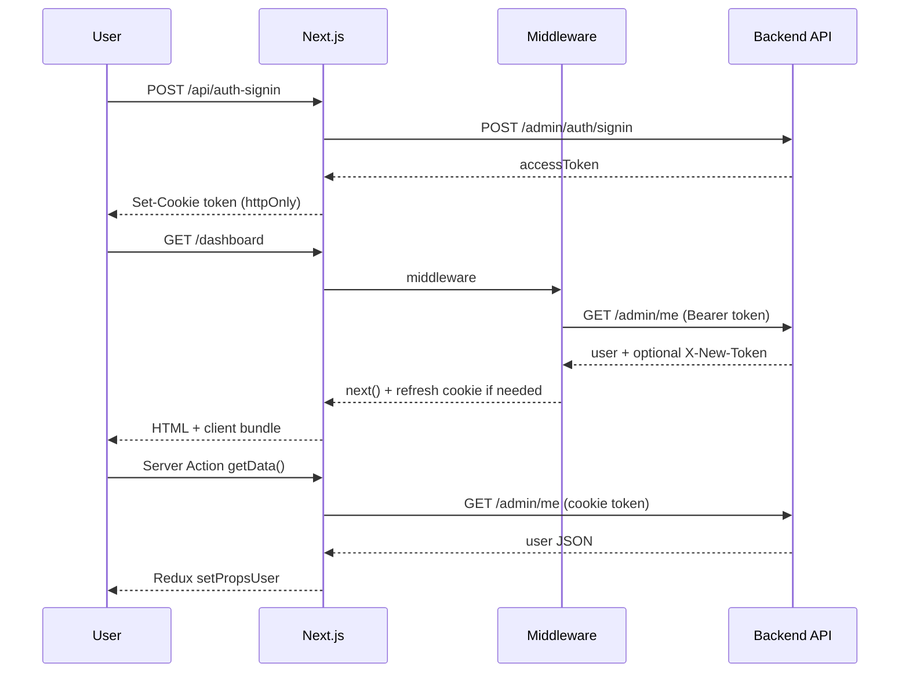

# Daddy Pay Admin — System Design

## Overview

Daddy Pay Admin is a **Next.js 15** web application that provides an administrative UI for shops, machines, programs, users, reports, and dashboards. It does not own business data; it proxies requests to a separate **backend API** (`API_URL`).

```
┌─────────────┐     HTTPS      ┌──────────────────┐     HTTPS      ┌─────────────────┐
│   Browser   │ ──────────────►│  Next.js (BFF)   │ ──────────────►│  Backend API    │
│  React UI   │   /api/*       │  App Router      │  /api/v1/admin │  (API_URL)      │
│  Redux      │   cookies      │  middleware      │  Bearer token  │                 │
└─────────────┘                └──────────────────┘                └─────────────────┘
```

## Runtime layers

| Layer | Location | Responsibility |
|-------|----------|----------------|
| **Edge middleware** | `src/middleware.ts` | Auth gate, `/admin/me`, token refresh, LRU cache (10 min) |
| **Pages** | `src/app/(appAuth)/**` | Feature UI (mostly client components) |
| **BFF API** | `src/app/api/**` | Proxy, FormData, token forward, error mapping |
| **Server Actions** | `src/app/actions.ts` | `getData()`, `clearDataUser()` |
| **Client state** | `src/store/**` | User, lang, master data, modals |

## Authentication flow



### Design decisions

1. **httpOnly `token` cookie** — JS cannot read token; reduces XSS token theft.
2. **Middleware validation** — Unauthenticated users never reach `(appAuth)` pages.
3. **No `x-user-data` header** — Full user JSON in headers exceeded proxy limits (502). User loaded via `/admin/me` in Server Actions instead.
4. **Dual `/me` calls** — Middleware and `getData()` may both call `/me` on a session; acceptable tradeoff for header safety. Optional future: shared server cache keyed by token.

### Token refresh

Backend may return:

- `X-Token-Refreshed: true`
- `X-New-Token: <jwt>`

Handled in:

- `middleware.ts` — updates cookie on page requests
- `headerUtils.ts` — API routes via `forwardHeaders` / `createResponseWithHeaders`

### Logout

- `GET /api/logout` — clears cookies
- `/login` route in middleware — clears token cache and cookie

## Routing

| Route group | Path examples | Auth |
|-------------|---------------|------|
| Public | `/login` | No |
| Protected | `/dashboard`, `/shop-info`, `/report/*` | Middleware + token |
| BFF | `/api/*` | Per-route cookie check (excluded from middleware matcher) |

Middleware matcher:

```typescript
matcher: ['/((?!api|_next/static|_next/image|images|.*\\.png$).*)']
```

## Data flow patterns

### Pattern A — Client page + BFF + Redux

Used by most admin pages.

1. Page (`'use client'`) mounts.
2. `AdminNavbar` calls `getData()` → user in Redux.
3. Page/hook calls `axios.get('/api/...')` → BFF → backend.
4. Lang strings from `/api/lang/list` → `langSlice`.

### Pattern B — Server Action for user only

`getData()` in `actions.ts` — used for navbar bootstrap, not for every entity.

### Pattern C — FormData upload

Shop create/edit: browser → `POST /api/shop-info` (multipart) → backend FormData.

## Feature modules

| Module | Pages | BFF / constants |
|--------|-------|-----------------|
| Dashboard | `(appAuth)/dashboard` | `api/dashboard/*`, `constants/dashboard.ts` |
| Reports | `(appAuth)/report/*` | `api/report/*`, `constants/report.ts` |
| Shop info | `(appAuth)/shop-info` | `api/shop-info/*`, `constants/shopInfo.ts` |
| Shop management | `(appAuth)/shop-management` | `api/shop-management/*` |
| Machine / Program | `machine-info`, `program-info` | `api/machine-info`, `api/program-info` |
| Users | `user-management` | `api/user/*`, `constants/user.ts` |
| i18n | `language-settings` | `api/lang/*`, `lib/getLangData.ts` |

## UI architecture

- **Layout shell**: `(appAuth)/layout.tsx` — `AdminNavbar`, `Sidebar`, `HeaderBar`, mobile overlay.
- **Design tokens**: Background `#ECEEF6`, sidebar offset `md:pl-[14rem]`, navbar height ~80px.
- **Component library**: Bootstrap + Font Awesome icons in menu config.
- **Charts**: Chart.js wrappers in `components/Dashboard/`.

## State management

```
store/
  features/
    userSlice.ts    # profile, role, permissions
    langSlice.ts    # i18n key → string
    masterSlice.ts  # shared dropdown data
    modalSlice.ts   # global modals
```

Server state is not normalized globally — each feature hook owns list/detail fetching.

## Error handling

| Context | Utility |
|---------|---------|
| API route 401 | `handleTokenExpiration()` |
| API route other | Map `AxiosError.response` to JSON + status |
| Client | `errorHandler.ts`, modal via `useErrorHandler` |
| React tree | `ErrorBoundary` component |

## Environment & deployment

| Variable | Usage |
|----------|--------|
| `API_URL` | Backend base for middleware, all BFF routes, Server Actions |

Deploy Next.js as Node server (`next start`) or platform equivalent. Ensure reverse proxy allows normal header sizes; do not rely on oversized custom headers for session payload.

## Security notes

- CORS less critical for same-origin BFF calls.
- Client must not call `API_URL` directly (would expose backend URL and complicate CORS/auth).
- Role checks in UI are **not** a security boundary — backend must enforce permissions on every API call.

## Related docs

- [AGENTS.md](./AGENTS.md) — agent entry point
- [RULE.md](./RULE.md) — coding rules
- [SKILL.md](./SKILL.md) — implementation workflows
