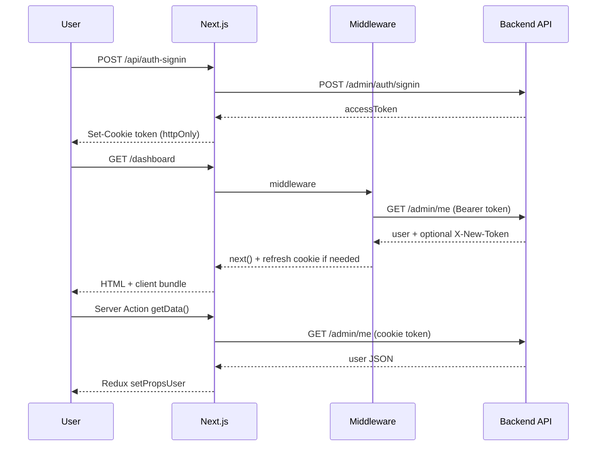

# Daddy Pay Admin — System Design

## Overview

Daddy Pay Admin is a **Next.js 15** web application that provides an administrative UI for shops, machines, programs, users, reports, and dashboards. It does not own business data; it proxies requests to a separate **backend API** (`API_URL`).

```
┌─────────────┐     HTTPS      ┌──────────────────┐     HTTPS      ┌─────────────────┐
│   Browser   │ ──────────────►│  Next.js (BFF)   │ ──────────────►│  Backend API    │
│  React UI   │   /api/*       │  App Router      │  /api/v1/admin │  (API_URL)      │
│  Redux      │   cookies      │  middleware      │  Bearer token  │                 │
└─────────────┘                └──────────────────┘                └─────────────────┘
```

## Runtime layers

| Layer | Location | Responsibility |
|-------|----------|----------------|
| **Edge middleware** | `src/middleware.ts` | Auth gate, `/admin/me`, token refresh, LRU cache (10 min) |
| **Pages** | `src/app/(appAuth)/**` | Feature UI (mostly client components) |
| **BFF API** | `src/app/api/**` | Proxy, FormData, token forward, error mapping |
| **Server Actions** | `src/app/actions.ts` | `getData()`, `clearDataUser()` |
| **Client state** | `src/store/**` | User, lang, master data, modals |

## Authentication flow



### Design decisions

1. **httpOnly `token` cookie** — JS cannot read token; reduces XSS token theft.
2. **Middleware validation** — Unauthenticated users never reach `(appAuth)` pages.
3. **No `x-user-data` header** — Full user JSON in headers exceeded proxy limits (502). User loaded via `/admin/me` in Server Actions instead.
4. **Dual `/me` calls** — Middleware and `getData()` may both call `/me` on a session; acceptable tradeoff for header safety. Optional future: shared server cache keyed by token.

### Token refresh

Backend may return:

- `X-Token-Refreshed: true`
- `X-New-Token: <jwt>`

Handled in:

- `middleware.ts` — updates cookie on page requests
- `headerUtils.ts` — API routes via `forwardHeaders` / `createResponseWithHeaders`

### Logout

- `GET /api/logout` — clears cookies
- `/login` route in middleware — clears token cache and cookie

## Routing

| Route group | Path examples | Auth |
|-------------|---------------|------|
| Public | `/login` | No |
| Protected | `/dashboard`, `/shop-info`, `/report/*` | Middleware + token |
| BFF | `/api/*` | Per-route cookie check (excluded from middleware matcher) |

Middleware matcher:

```typescript
matcher: ['/((?!api|_next/static|_next/image|images|.*\\.png$).*)']
```

## Data flow patterns

### Pattern A — Client page + BFF + Redux

Used by most admin pages.

1. Page (`'use client'`) mounts.
2. `AdminNavbar` calls `getData()` → user in Redux.
3. Page/hook calls `axios.get('/api/...')` → BFF → backend.
4. Lang strings from `/api/lang/list` → `langSlice`.

### Pattern B — Server Action for user only

`getData()` in `actions.ts` — used for navbar bootstrap, not for every entity.

### Pattern C — FormData upload

Shop create/edit: browser → `POST /api/shop-info` (multipart) → backend FormData.

## Feature modules

| Module | Pages | BFF / constants |
|--------|-------|-----------------|
| Dashboard | `(appAuth)/dashboard` | `api/dashboard/*`, `constants/dashboard.ts` |
| Reports | `(appAuth)/report/*` | `api/report/*`, `constants/report.ts` |
| Shop info | `(appAuth)/shop-info` | `api/shop-info/*`, `constants/shopInfo.ts` |
| Shop management | `(appAuth)/shop-management` | `api/shop-management/*` |
| Machine / Program | `machine-info`, `program-info` | `api/machine-info`, `api/program-info` |
| Users | `user-management` | `api/user/*`, `constants/user.ts` |
| i18n | `language-settings` | `api/lang/*`, `languageSettingsService`, `LanguageSettings/` components |

## Frontend feature module layout

Standard structure for `(appAuth)` features (canonical example: **language-settings**):

```
page.tsx  →  useFeatureViewModel()  →  FeatureView  →  Header / Filter / Table / Modals
                ↓
         featureService.ts  →  /api/* BFF  →  API_URL
```

- **ViewModel**: orchestration only (no JSX).
- **FeatureView**: layout composition only — map `lang` to props; **no axios**.
- **Sub-components**: one file per major UI block under `components/<Feature>/`.
- **Do not** put header + filter + table + modals in a single `page.tsx` or a single 100+ line `*View.tsx`.

Canonical examples: `LanguageSettings/`, `ShopManagementTransaction/`.

## UI design system (required)

**Before building new UI**, copy patterns from the nearest existing feature. Do not invent new layout libraries, color systems, or one-off components when a shared one exists.

Full coding rules: [RULE.md](./RULE.md#ui-design-required). Reference UIs:

| Pattern | Reference files |
|---------|-----------------|
| Feature layout (ViewModel + sub-views) | `LanguageSettings/`, `ShopManagementTransaction/` |
| List + filter + table | `shop-info/` + `ShopInfoFilter`, `ShopInfoHeader`, `ShopTableRow` |
| Report filters | `Filter/FilterReport.tsx`, `FilterReportBank.tsx` |
| Detail with back | `ShopManagementTransactionHeader.tsx` |
| Row actions + modals | `ShopTableRow.tsx`, `Modals/ModalActionBank.tsx`, `ModalActionOnlinePayment.tsx` |
| Full-page form | `ShopInfoForm/`, `UserInfo/UserForm.tsx` |

### Page shell

Every protected list/detail page uses the same outer wrapper:

```tsx
<main className="bg-white p-2 md:p-4" role="main">
  <ErrorBoundary>
    {/* Header → Filter → Table → Modals */}
  </ErrorBoundary>
</main>
```

- App background: `#ECEEF6` (set in `(appAuth)/layout.tsx`).
- Content area: white card via `bg-white` on `<main>`.

### Layout blocks (compose in `*View.tsx`)

| Block | Responsibility | Typical classes / components |
|-------|----------------|------------------------------|
| **Header** | Title, back, primary action (Add) | `ShopInfoHeader`, `*Toolbar`, `*Header` |
| **Filter** | Search / dropdowns / date range | `Form` + `grid grid-cols-1 md:grid-cols-3 gap-3`, `border-b border-gray-200 pb-3 mb-4` |
| **Table** | Data grid + pagination | `TableComponent`, `LoadingSkeleton`, `CustomPagination` |
| **Modals** | Create/edit/delete/confirm | `components/Modals/*` or `components/<Feature>/*Modal.tsx` |

### Styling stack

| Use | For |
|-----|-----|
| **react-bootstrap** | `Button`, `Form`, `Modal`, `Table`, `Dropdown`, `Col` |
| **Tailwind utilities** | Grid, spacing, responsive width (`md:w-1/3`, `text-xs md:text-sm`) |
| **Font Awesome** | Icons: `fa-solid fa-search`, `fa-plus`, `fa-pen-to-square`, `fa-trash`, `fa-bank` |
| **`cn()` from `@/lib/utils`** | Conditional classes on dropdowns/toggles |

Do **not** add MUI, Ant Design, or other UI kits.

### Tables

- Wrapper: `components/Table/Table.tsx` (`TableComponent`).
- Headers: from `lang` via helper (e.g. `getShopInfoTableHeaders(lang)`).
- Loading: `LoadingSkeleton` with `COLUMN_COUNT` from feature constants.
- Empty: one `<tr><td colSpan={n}>` + `lang['global_no_data']`.
- Cell text: `text-xs md:text-sm`; row index via `noIndex()` / `getRowNumber()`.
- Pagination: `handleActive` on `TableComponent`; page size from `PAGINATION_CONFIG` in `constants/main.ts`.

### Filters

- Submit on `Form` `onSubmit` → `e.preventDefault()` → callback to ViewModel/hook.
- Search button: `variant="primary"`, icon `fa-solid fa-search`, label `lang['global_search']`.
- Shop/status dropdowns: `Dropdown` + `nav-dropdown-w` + `cn()` (see `ShopInfoFilter`, `FilterReportBank`).
- Date range: `DatePickerRange` from `components/FormGroup/DatePickerRange.tsx`.
- Narrow fields: `w-full md:w-1/3` on `Form.Group` when spec asks for 1/3 width.

### Buttons (action column)

| Action | variant | Icon |
|--------|---------|------|
| Add (header) | `primary` | `fa-plus` |
| Edit | `warning` | `fa-pen-to-square` |
| Delete | `danger` | `fa-trash` |
| Bank / payment | `info` / `primary` | `fa-bank` / `fa-credit-card` |
| Back | `secondary` | `fa-arrow-left` |

Use `size="sm"` in table rows; `className="ml-2"` between adjacent buttons.

### Modals

- `Modal` from react-bootstrap: `centered`, `Modal.Header` with `closeButton`, `className="py-2"`.
- Footer: primary Save (`fa-floppy-disk`) + secondary Cancel (`fa-xmark`).
- Confirm delete: `ModalActionDelete`.
- Alerts / validation errors: `openModalAlert` from `modalSlice` (not `window.alert`).
- Long operations: `setProcess(true/false)` from `modalSlice` where siblings do.

### Forms (add/edit pages)

- Reuse `components/FormGroup/inputForm.tsx`, `dropdownForm.tsx`, `uploadFileForm.tsx`.
- Full entity forms: `ShopInfoForm`, `UserForm` — match their `Row` / `Col` layout.
- Client validation: `utils/*Validation.ts` or `validateRequiredFields.ts`; show errors via `openModalAlert` or field `isInvalid`.

### Status badges (table cells)

- Format in `utils/*Utils.ts` (e.g. `formatShopStatus`, `formatOnlinePaymentStatus`, `formatSubscriptionStatus`).
- Display: `<span className={display.className}>{display.text}</span>`.
- Colors: `text-success` (active/enable), `text-danger` (inactive/disable/expired), `text-muted` (unknown).
- Status values: constants in `constants/<feature>.ts` (`SHOP_STATUS`, `ONLINE_PAYMENT_STATUS`, etc.).

### i18n (all visible text)

- `const lang = useAppSelector(state => state.lang)`.
- Keys in `languageDefault.json`: `page_*`, `button_*`, `global_*`, `filter_*`, `validation_*`, `modal_*`.
- Pass **resolved strings** into presentational children (labels props), not raw keys.

### Shared components map

```
components/
  Table/          TableComponent, CustomPagination, LoadingSkeleton, SortableRow
  FormGroup/      inputForm, dropdownForm, DatePickerRange, uploadFileForm
  Modals/         ModalForm, ModalAlert, ModalActionDelete, ModalActionBank, …
  Filter/         FilterReport, FilterReportBank, FilterDashboard
  ErrorBoundary/  wrap page content
  <Feature>/      feature-specific Header, Filter, Table, View
```

### UI checklist (new/changed screens)

- [ ] Same `<main className="bg-white p-2 md:p-4">` + `ErrorBoundary` as siblings
- [ ] Header / Filter / Table split into separate files under `components/<Feature>/`
- [ ] `TableComponent` + pagination, not raw `<table>` alone
- [ ] Loading + empty states match existing tables
- [ ] Buttons use project variants + Font Awesome icons
- [ ] Modals match `ModalAction*` / `ModalForm` patterns
- [ ] All labels from `lang['key']` + `languageDefault.json`
- [ ] Status columns use formatter utils + semantic colors

## State management

```
store/
  features/
    userSlice.ts    # profile, role, permissions
    langSlice.ts    # i18n key → string
    masterSlice.ts  # shared dropdown data
    modalSlice.ts   # global modals
```

Server state is not normalized globally — each feature hook owns list/detail fetching.

## Error handling

| Context | Utility |
|---------|---------|
| API route 401 | `handleTokenExpiration()` |
| API route other | Map `AxiosError.response` to JSON + status |
| Client | `errorHandler.ts`, modal via `useErrorHandler` |
| React tree | `ErrorBoundary` component |

## Environment & deployment

| Variable | Usage |
|----------|--------|
| `API_URL` | Backend base for middleware, all BFF routes, Server Actions |

Deploy Next.js as Node server (`next start`) or platform equivalent. Ensure reverse proxy allows normal header sizes; do not rely on oversized custom headers for session payload.

## Security notes

- CORS less critical for same-origin BFF calls.
- Client must not call `API_URL` directly (would expose backend URL and complicate CORS/auth).
- Role checks in UI are **not** a security boundary — backend must enforce permissions on every API call.

## Related docs

- [AGENTS.md](./AGENTS.md) — agent entry point
- [RULE.md](./RULE.md) — coding rules
- [SKILL.md](./SKILL.md) — implementation workflows
